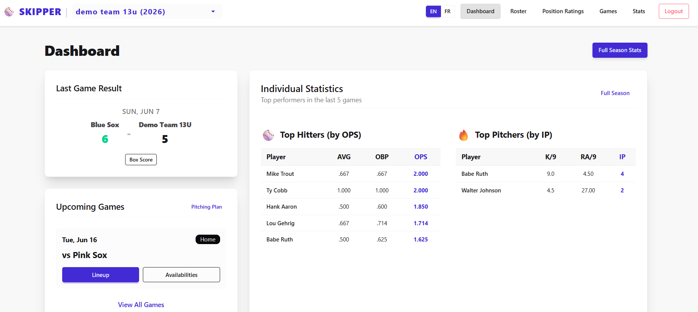
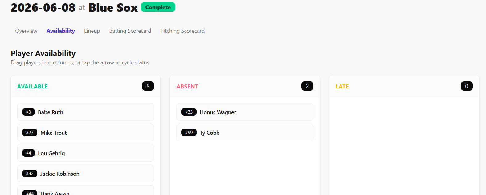
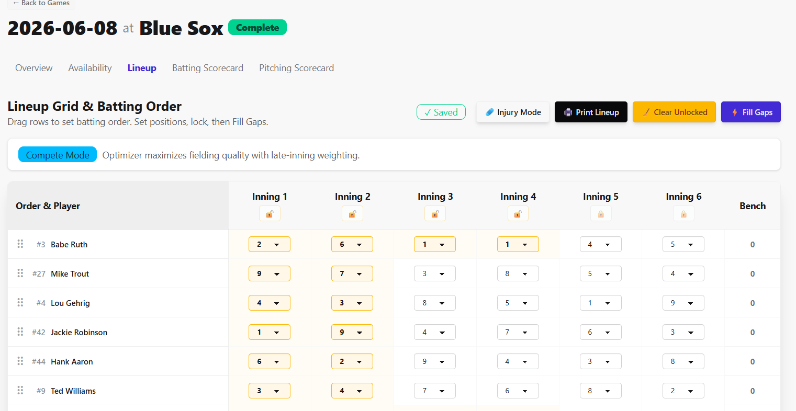
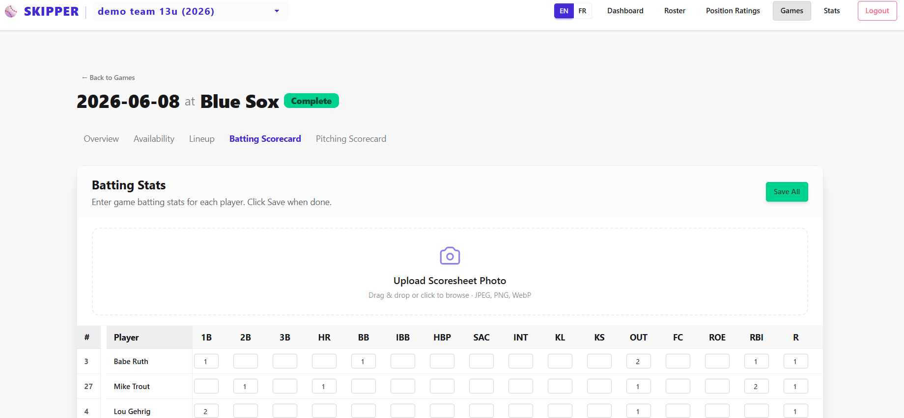
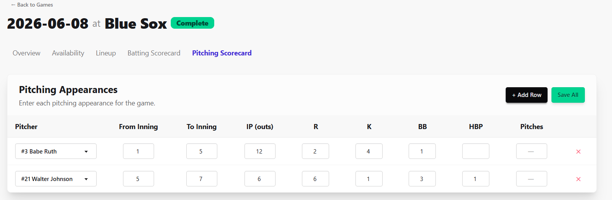
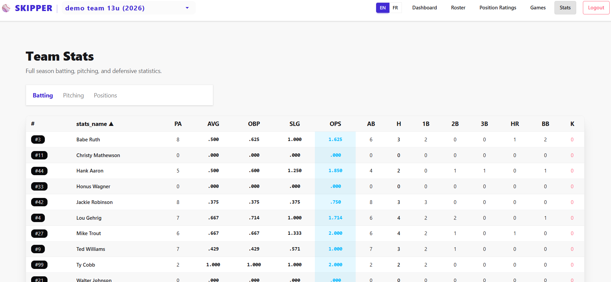

# ⚾ Skipper

**Skipper** is a coach-first web app for youth and amateur baseball teams. It handles the full game-day workflow — roster, availability, lineup optimization, official printouts, box scores, and season stats — in one place. FastAPI backend, SvelteKit frontend, deployed as a single container on [Fly.io](https://fly.io).

## Built for real coaching workflows

Skipper was originally built for **Baseball Québec** house-league and competitive teams: coaches who need to submit an official **Ordre des Frappeurs** before each game, enter stats from a **feuille de pointage** after the game, and respect **pitch-count and rest rules** across a busy weekly schedule.

**Baseball Québec is the default league format** — lineup printouts and AI scoresheet parsing use the Québec template out of the box. Other leagues can plug in their own formats via `tenants.json` (see [League formats](#league-formats) below).

## Why coaches use Skipper

- **Stop rebuilding lineups from scratch** — an optimizer assigns positions inning-by-inning from your ratings, respects absences and injuries, and balances bench time fairly.
- **Compete or develop on purpose** — switch game mode to maximize fielding strength in tight games, or maximize position variety for player development.
- **Game day, sorted** — track who's in, who's out, lock key positions, print the official batting-order card, and go.
- **Stats without the spreadsheet grind** — snap a photo of the scoresheet and let AI pre-fill the batting grid; review, tweak, and save.
- **Pitching rules enforced for you** — configurable pitch-count limits and rest days; eligibility checked before a player is sent to the mound.
- **One login, multiple teams** — manage several rosters (e.g. 13U and 15U) with isolated data and per-team league settings.
- **Season view that actually helps** — batting, pitching, and position stats filtered by game type so you can see trends, not just totals.

## Features

| Area | What you get |
|------|----------------|
| **Dashboard** | Upcoming games, recent results, and quick season snapshots |
| **Roster** | Players, substitutes, head/assistant coaches, jersey numbers, default batting order |
| **Position ratings** | Rate each player at every position; mark spots as forbidden |
| **Schedule** | Season, tournament, and scrimmage games with opponent, venue, home/away |
| **Availability** | Per-game present / absent / injured status; mid-game injury tracking |
| **Lineup optimizer** | CP-SAT solver with compete & develop modes, locked cells, bench fairness, pitcher re-entry and rest constraints |
| **Batting order** | Drag-and-drop order with printable official lineup card |
| **Box scores** | Batting and pitching entry; photo-assisted scoresheet import (optional) |
| **Stats** | Season batting, pitching, and position breakdowns |
| **Multi-tenant** | Team-based access via Google Sign-In; settings per team in `tenants.json` |

## Screenshots

Screenshots use **demo data only** — regenerate locally with [`bootstrap/`](bootstrap/README.md).

<p align="center">
  
</p>
<p align="center"><em>Dashboard — recent results, upcoming games, and top performers</em></p>

<table>
  <tr>
    <td width="50%"></td>
    <td width="50%"></td>
  </tr>
  <tr>
    <td align="center"><em>Availability — drag players between columns</em></td>
    <td align="center"><em>Lineup — inning grid with optimizer</em></td>
  </tr>
  <tr>
    <td width="50%"></td>
    <td width="50%"></td>
  </tr>
  <tr>
    <td align="center"><em>Batting scorecard — manual entry or photo upload</em></td>
    <td align="center"><em>Pitching appearances — IP, runs, strikeouts</em></td>
  </tr>
</table>

<p align="center">
  
</p>
<p align="center"><em>Season stats — batting, pitching, and positions</em></p>

## League formats

Lineup printouts and scoresheet photo parsing are **league-specific**. Configure each tenant in `backend/app/tenants.json`:

```json
{
  "name": "Mon équipe 13U",
  "lineup_print_version": "baseball_quebec",
  "scoresheet_version": "baseball_quebec"
}
```

| Field | Purpose |
|-------|---------|
| `lineup_print_version` | Printable batting-order card layout (default: `baseball_quebec` — Ordre des Frappeurs) |
| `scoresheet_version` | AI prompt/legend for photo scoresheet import (default: `baseball_quebec` — feuille de pointage) |

To add a new league, register a backend prompt in `backend/app/league_formats/` and a frontend print component in `frontend/src/lib/league_formats/`. Existing tenants without these fields keep the Baseball Québec defaults.

## Prerequisites

- Python 3.10+
- Node.js 18+ and npm
- WSL (recommended when developing on Windows)

## Quick start (local)

### 1. Configure environment

```bash
cp backend/.env.dist backend/.env
cp backend/app/tenants.json.example backend/app/tenants.json
```

Edit `backend/.env`:
- Set `GOOGLE_CLIENT_ID` from the [Google Cloud Console](https://console.cloud.google.com)
- Add `http://localhost:5173` to **Authorized JavaScript Origins** for your OAuth client
- Keep `DEV_MODE=true` for local development (auto-provisions users on first login)
- Optional: set `SKIPPER_LOCALE=en` or `SKIPPER_LOCALE=fr` to lock the app to one language (also set the same variable when running the frontend dev server, or add it to `frontend/.env`)

Edit `backend/app/tenants.json` with your team names, league format versions, pitch-count rules, and admin email addresses.

### 2. Backend

```bash
cd backend
python3 -m venv .venv
source .venv/bin/activate   # Windows/WSL
pip install -r requirements.txt
python -m uvicorn app.main:app --reload
```

API runs at `http://127.0.0.1:8000`.

### 3. Frontend

```bash
cd frontend
npm install
npm run dev
```

App runs at `http://localhost:5173`.

## Bootstrap data

After logging in, seed sample players and games. See [`bootstrap/README.md`](bootstrap/README.md).

```bash
export SKIPPER_URL="http://localhost:5173"
export TOKEN="your_jwt_token_here"

curl -X POST "$SKIPPER_URL/api/players/" \
  -H "Content-Type: application/json" \
  -H "X-Active-Team-ID: 1" \
  -H "Authorization: Bearer $TOKEN" \
  -d '{"first_name": "Babe", "last_name": "Ruth", "jersey": 3, "active": true}'
```

## Running tests

```bash
# Backend (from repo root, in WSL)
bash scripts/test_backend.sh

# Frontend type-check
cd frontend && npm run check
```

## Deployment

See [`DEPLOYMENT.md`](DEPLOYMENT.md) for Fly.io setup. Deploy with:

```bash
bash deploy.sh
```

## Project structure

```
backend/     FastAPI API, SQLite database, lineup optimizer, league format plugins
frontend/    SvelteKit UI, printable lineup formats
bootstrap/   Seed scripts and CSV templates
docs/        Screenshot gallery for README (`docs/screenshots/`)
Dockerfile   Unified production image
fly.toml     Fly.io configuration
deploy.sh    Deployment helper (reads FLY_APP_NAME from backend/.env)
backup_db.sh Database backup helper (reads FLY_APP_NAME from backend/.env)
```

## License

MIT — see [LICENSE](LICENSE).
